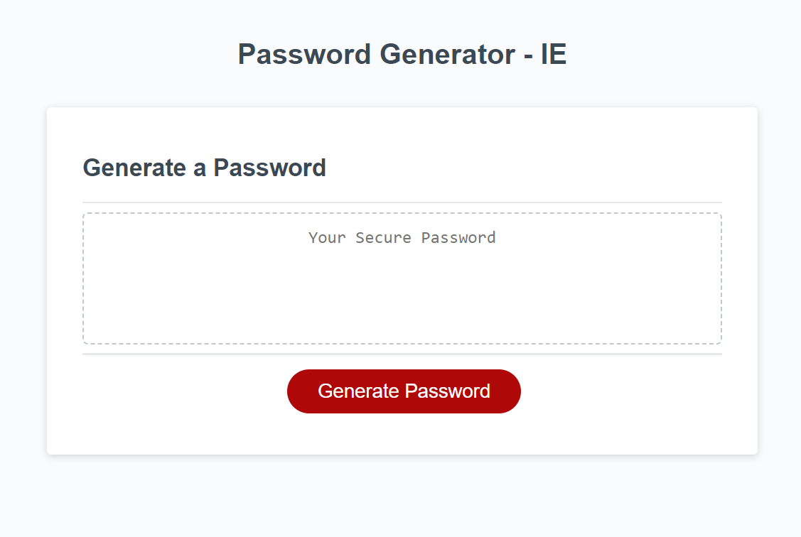
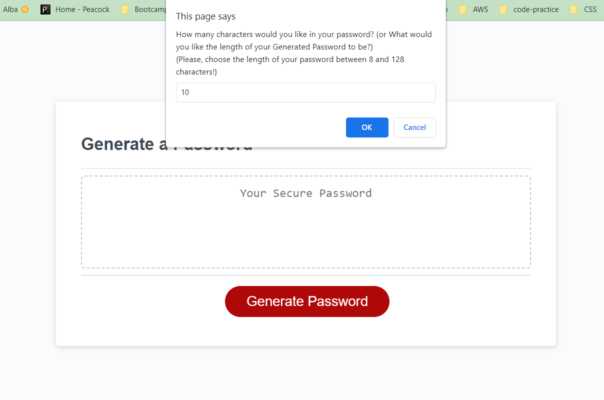
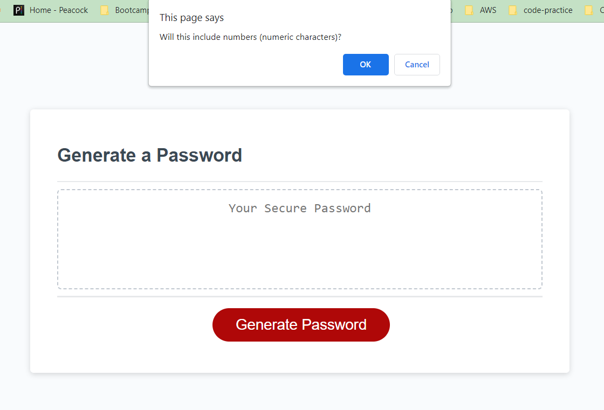
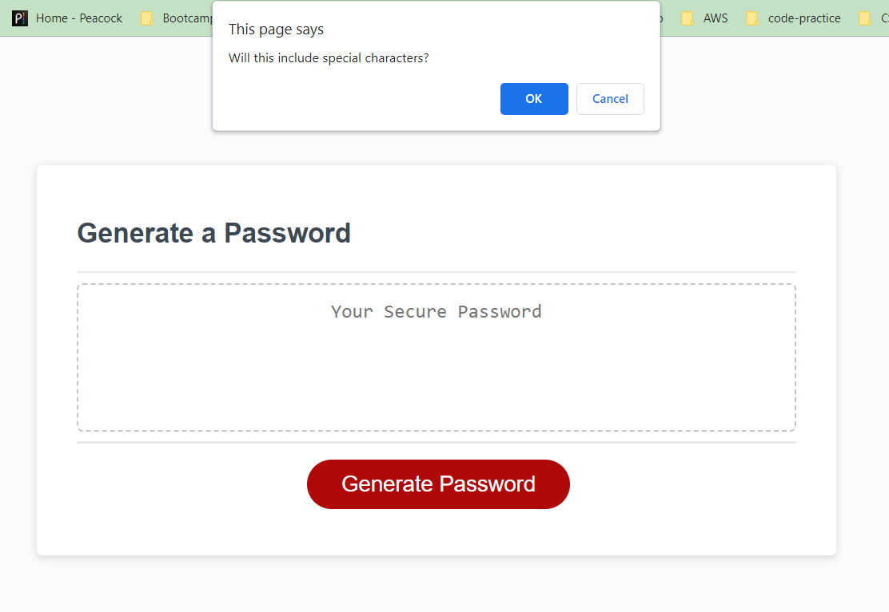
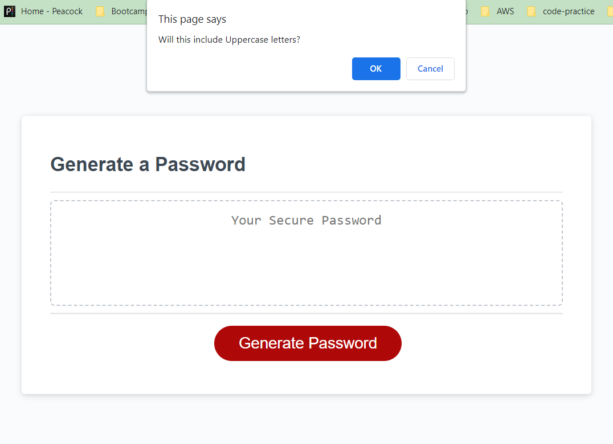
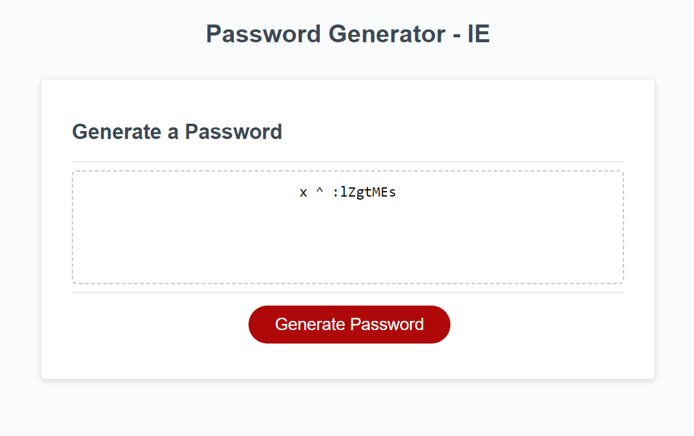

# Password Generator - IE

## Description

I WANT to randomly generate a password that meets certain criteria
SO THAT I can create a strong password that provides greater security.

## Installation

A step-by-step description of how to get the development environment running:

1. WHEN I click the button to generate a password, THEN I am presented with a series of prompts for password criteria;
2. WHEN prompted for password criteria, THEN I select which criteria to include in the password;
3. WHEN prompted for the length of the password, THEN I choose a length of at least 8 characters and no more than 128 characters
4. WHEN asked for character types to include in the password, THEN I confirm whether or not to include lowercase, uppercase, numeric, and/or special characters
5. WHEN I answer each prompt, THEN my input should be validated and at least one character type should be selected
6. WHEN all prompts are answered, THEN a password is generated that matches the selected criteria
7. WHEN the password is generated, THEN the password is written to the page.

## Features

  * HTML
  * CSS
  * JavaScript
  * DOM

## Usage

### Screenshots:
    

## Website 

### link to deployed application:

https://ikaera.github.io/Password-Generator-IE/

## Credits

Code example demonstrated in a youtube video: 
Source: https://youtu.be/9sT03jEwcaw

